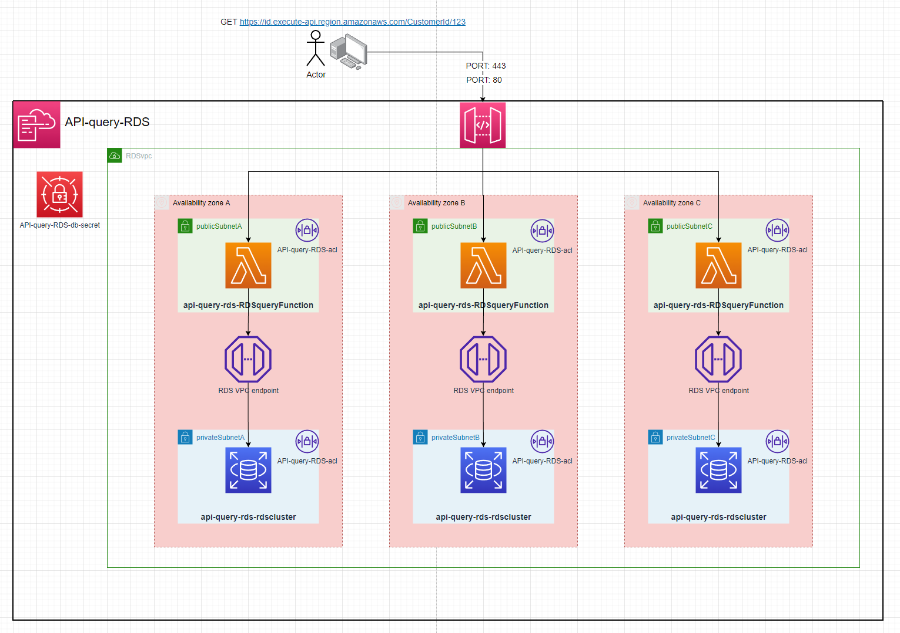
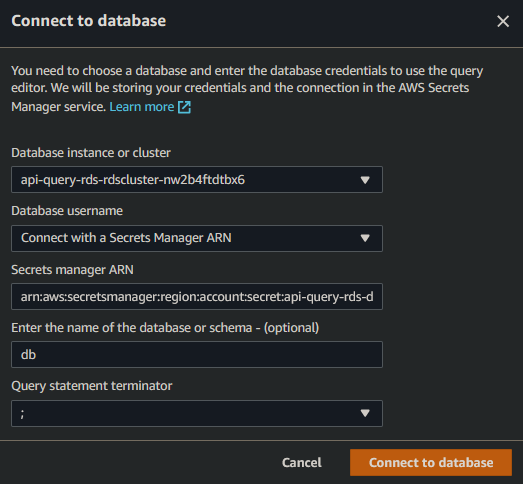

# API-query-RDS




---

# Setup:
1. Deploy project to aws
2. Copy the `RDSDBSecretArn` output by the stack
3. Go to RDS & select `Query` on the database
4. enter these credentials with the `Secrets manager ARN` as the `RDSDBSecretArn`

5. create the `Customers` Table
```sql
CREATE TABLE Customers (
  CustomerId int,
  FirstName varchar(255)
)
```
6. create a few example customers
```sql
INSERT INTO Customers (CustomerId, FirstName) VALUES (100, 'Name');
INSERT INTO Customers (CustomerId, FirstName) VALUES (101, 'Name1');
INSERT INTO Customers (CustomerId, FirstName) VALUES (102, 'Name2');
```
7. make a `GET` request to the `HttpApiUrl` output by the stack. Making a GET request to `https://ID.execute-api.region.amazonaws.com/CustomerId/100`. You will recieve:
```json
[
    {
        "CustomerId": 100,
        "FirstName": "Name"
    }
]
```